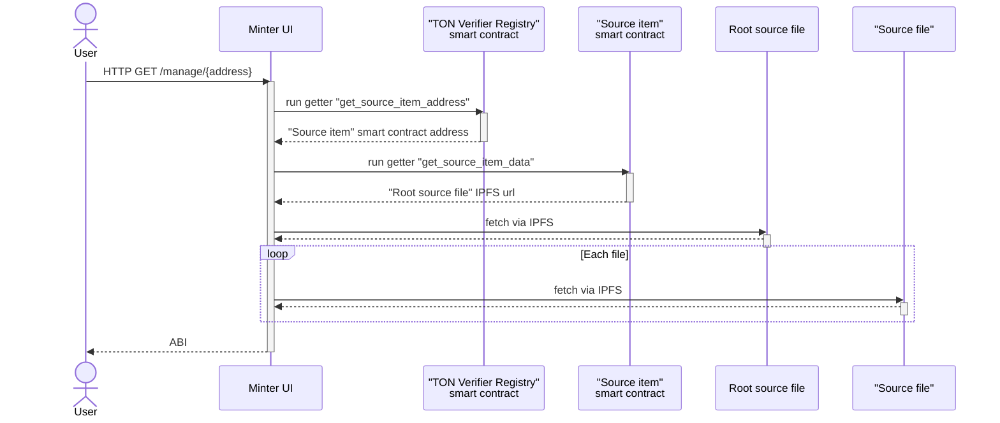

# Developer Guide for DevTools

## How ABI getting works?

__Participants__:

- "TON Verifier Registry" - TON Verifier smart contract that correspond contract state init `code` with "Source item" smart contract addres
- "Source item" - specific for `code` smart contract that stores IPFS url leading "Root source file"
- "Root source file" - JSON file with list of all source code file IPFS urls for specific contract
- "Source file" - source file item (e.g. ".pkg"/".tact"/".abi" file)
 

