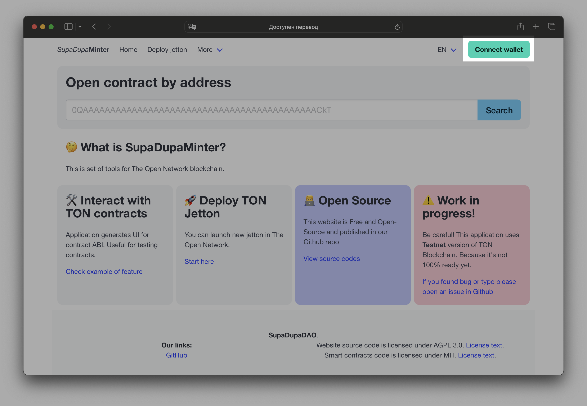
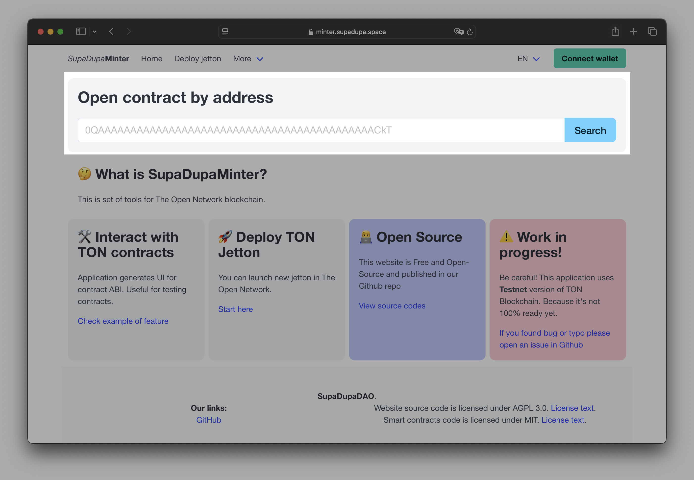
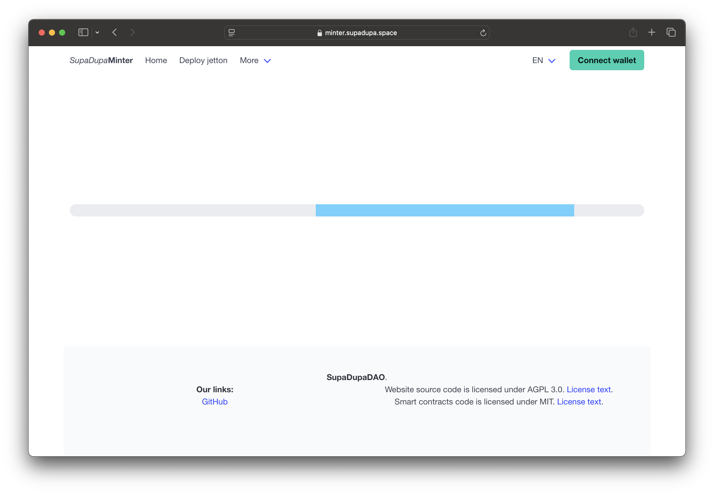
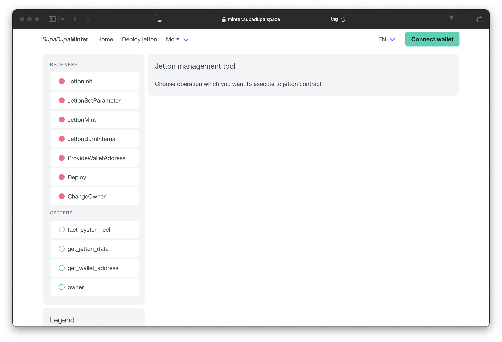
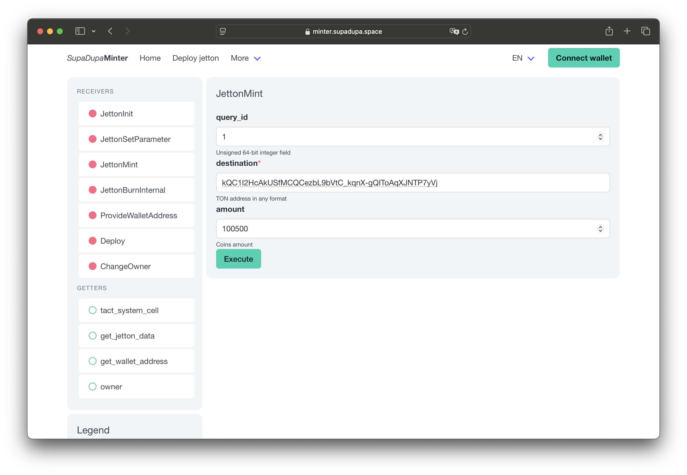

# User Guide for DevTools

## How to use DevTools

1. Open <i>SupaDupa</i><b>Minter</b> [main page](https://minter.supadupa.space)

2. Click to "Connect Wallet" button

3. Model window with QR code will be open. Scan this code with your TON Wallet application (e.g. TON Keeper)

4. Fill in "Open contract by address" field with contract address you need and click "Search"

5. Browser will show loading bar. It could take some time. If loading is too long (more than minute, refresh page)

6. When loading is finished, there will be page of DevTools application

7. In left menu choose contract message you need to send to contract, fill fields for it operation and click "Execute" button for creating transaction

